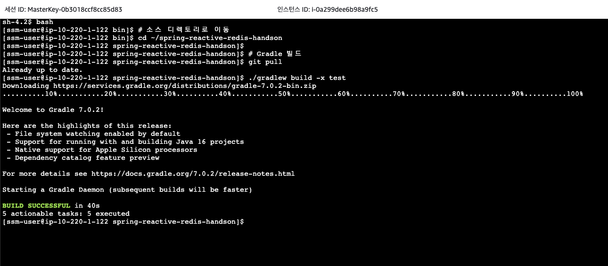
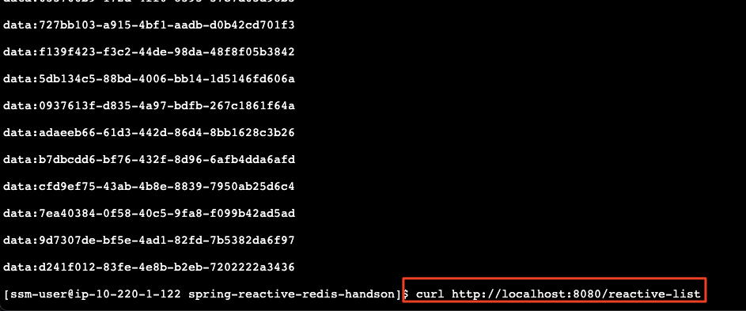

# 빌드, 실행 및 테스트

## 빌드
아래와 같이 수행하여 리액티브 어플리케이션을 빌드합니다.<br>

```bash
# 소스 디렉토리로 이동
cd ~/spring-reactive-redis-handson

# Gradle 빌드
./gradlew build -x test
```



## 리액티브 어플리케이션 실행

```bash
# 프로그램 실행
nohup java -XX:+HeapDumpOnOutOfMemoryError -Duser.timezone=Asia/Seoul -jar build/libs/spring-reactive-redis-handson-0.0.1-SNAPSHOT.jar &

# 실행 확인
lsof -i -P -n | grep 8080
```


## 테스트
빌드된 어플리케이션은 자체 레디스 서버를 내장하고 있습니다. (Embedded Redis Server)<br>
이를 활용하여 아래와 같이 테스트를 수행해 봅니다.

1. 10만 개의 테스트 데이터 적재
```bash
curl http://localhost:8080/load
```


2. 전통적인 방식의 동기 방식으로 데이터를 조회
```bash
curl http://localhost:8080/normal-list
```


3. 리액티브/비동기 방식으로 데이터를 조회
```bash
curl http://localhost:8080/reactive-list
```


위 2와 3의 차이가 느껴지시나요?!

## 성능 비교

사용자 경험의 극명한 차이 외에도 리액티브하게 호출함으로써 성능 측면에서의 개선도 꾀할 수 있습니다.

아래는 전통적인 동기적인 호출과 리액티브 호출의 응답 시간 차이를 보여줍니다.

1. 동기 호출 방식 (전체 호출 시간 예시)<br>
```bash
time curl http://localhost:8080/normal-list
```


2. 리액티스/비동기 호출 방식 (전체 호출 시간 예시)<br>
```bash
time curl http://localhost:8080/reactive-list
```


이러한 차이가 생기는 원인은 아마 쉽게 직관적으로 짐작하실 수 있으리라 생각됩니다.<br>

즉, 리액트브하게 구현된 동작은, 동기적 호출에서 10만개의 데이터가 레디스로부터 백엔드 서버로 적재되는 동안에 기다리는 시간 낭비 없이, 모든 데이터가 비동기적으로 준비되어 필요할 때만 메시지 스트림으로 호출자에게 바로 바로 Back-feeding되기 때문일 것입니다.

---

> **이로써 로컬에서 내장 레디스 서버를 사용하여 리액티브 어플리케이션을 간단하게 체험해 보았습니다. 다음 섹션에서는 앞서 CDK로 이미 배포된 실제 레디스 서버를 사용하여 어플리케이션을 실행시켜 보도록 하겠습니다.**<br><br>
> 클라우드 환경에서 레디스 서버를 비동기적으로 처리하는 사용 패턴은 자주 발생하는 유스 케이스임을 유념해 주시기 바랍니다.

---

## [[이전]](2-tooling-and-cloning-application-source-code.md) | [[다음]](4-test-with-aws-easticache-for-redis.md)

