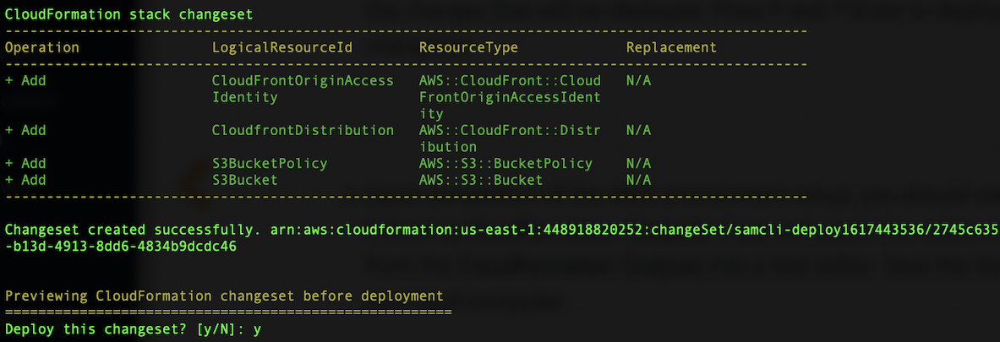
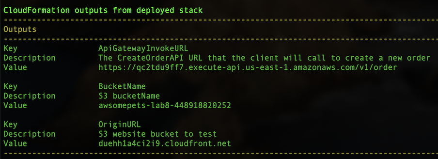

# AWSomePets S3 웹 호스팅 설치

이제 AWSomePets 단일 페이지 애플리케이션 (SPA) 호스팅을 설정해 봅니다. 웹 사이트를 호스팅하려면 S3 버킷이 필요하고 CloudFront를 CDN으로도 사용할 것입니다. 보안을 위해 S3 버킷에 대한 직접적인 퍼블릭 액세스를 허용하지 않고 CloudFront가 S3 버킷에 액세스하는 것만 허용하도록 정책을 구성합니다.

## S3 버킷 및 CloudFront 설정
1. ```awsomepets-serverless``` 폴더에서 ```template.yaml``` 파일을 편집합니다. 이것은 이전 과정에서 AWS 계정에 서버리스 스택을 배포하는 데 사용된 SAM 파일입니다.<br>

2. ```template.yaml``` 파일에서 ```Resources:``` 줄을 검색합니다. 이는 AWS 계정에서 SAM에 의해서 생성될 서비스 정의입니다. yaml 파일의 ```Resources:``` 줄을 아래 코드로 바꿉니다. 다른 기존 코드 줄을 덮어쓰지 말고 올바른 탭 간격을 유지하는 것에도 주의해 주세요.<br>
```yaml
Resources:
    # Cloudfront setup for SAGA and S3 endpoint
    CloudFrontOriginAccessIdentity:
        Type: 'AWS::CloudFront::CloudFrontOriginAccessIdentity'
        Properties:
            CloudFrontOriginAccessIdentityConfig:
                Comment: 'Saga website pattern'
    CloudfrontDistribution:
        Type: "AWS::CloudFront::Distribution"
        Properties:
            DistributionConfig:
                Comment: "Cloudfront distribution for serverless website"
                DefaultRootObject: "index.html"
                Enabled: true
                HttpVersion: http2
                # List of origins that Cloudfront will connect to
                Origins:
                    - Id: s3-website
                      DomainName: !GetAtt S3Bucket.DomainName
                      S3OriginConfig:
                          # Restricting Bucket access through an origin access identity
                          OriginAccessIdentity:
                              Fn::Sub: 'origin-access-identity/cloudfront/${CloudFrontOriginAccessIdentity}'
                # To connect the CDN to the origins you need to specify behaviours
                DefaultCacheBehavior:
                    # Compress resources automatically ( gzip )
                    Compress: 'true'
                    AllowedMethods:
                        - GET
                        - HEAD
                        - OPTIONS
                    ForwardedValues:
                        QueryString: false
                    TargetOriginId: s3-website
                    ViewerProtocolPolicy : redirect-to-https
    S3Bucket:
        Type: AWS::S3::Bucket
        Properties:
            # Change bucket name to reflect your website
            BucketName:
                Fn::Sub: 'awsomepets-lab8-${AWS::AccountId}'
    S3BucketPolicy:
        Type: AWS::S3::BucketPolicy
        Properties:
            Bucket: !Ref S3Bucket
            PolicyDocument:
                # Restricting access to cloudfront only.
                Statement:
                    -
                        Effect: Allow
                        Action: 's3:GetObject'
                        Resource:
                            - !Sub "arn:aws:s3:::${S3Bucket}/*"
                        Principal:
                            AWS: !Sub "arn:aws:iam::cloudfront:user/CloudFront Origin Access Identity ${CloudFrontOriginAccessIdentity}"
```


3. 이제 템플릿에서 CloudFront, S3 및 S3 정책 리소스를 정의했습니다. 이 템플릿은 CloudFront CDN에서 배포한 콘텐츠와 함께 awsomepets-lab8-<YourAccountId>라는 이름 형식으로 S3 버킷을 생성합니다. CloudFront로 웹 사이트를 배포하고 S3 버킷을 공개하지 않는 것이 보안 관점에서 항상 모범 사례입니다.

4. 이제 여전히 template.yaml을 편집하는 동안 Outputs: 줄을 검색합니다. yaml 파일의 Outputs: 줄을 아래 코드로 바꿉니다. 다른 기존 코드 줄을 덮어쓰지 말고 올바른 탭 간격을 기록해 두십시오. 이 정의는 SAM 배포가 완료되면 CloudFront 도메인 URL과 S3 버킷 이름을 표시합니다.
```yaml
Outputs:
    OriginURL:
        Description: S3 website bucket to test
        Value: !GetAtt CloudfrontDistribution.DomainName
    BucketName:
        Description: S3 bucketName
        Value: !Ref S3Bucket
```

5. 정의된 새 리소스를 만들려면 다음 명령을 실행합니다.
```bash
sam build
sam deploy --guided
```

6. 프로세스 전반에 걸쳐 구성 값을 입력하라는 메시지가 다시 표시됩니다. 연결된 구성 매개변수에 대해 아래 값을 사용하십시오. 값을 비우려면 Enter를 누르십시오.

```bash
Stack Name [sam-app]: awsomepets  
AWS Region [us-east-1]:  
Parameter StageName [v1]: 
Confirm changes before deploy [y/N]: y  
Allow SAM CLI IAM role creation [Y/n]: y  
Save arguments to configuration file [Y/n]: y  
SAM configuration file [samconfig.toml]:  
SAM configuration environment [default]:
```

7. SAM 도구는 이전 배포와의 차이점을 감지하고 배포될 변경 사항을 표시합니다. Y와 Enter를 눌러 변경 세트를 배포합니다.


8. AWS 환경 설정이 완료되면 다음 Cloudformation 출력이 표시되어야 합니다. Cloudformation 출력에서 출력된 값을 복사하여 텍스트 편집기에 붙여넣습니다. 로컬 컴퓨터에 텍스트 파일을 저장합니다.


9. cd ..를 입력하여 기본 폴더로 다시 이동합니다.


10. awsomepets-frontend.zip 링크를 클릭하여 빌드 파일을 다운로드하거나 다음 명령을 실행하여 파일을 다운로드합니다.
```bash
curl -k https://workshops.devax.academy/monoliths-to-microservices/module8/files/awsomepets-frontend.zip -o awsomepets-frontend.zip
```

11. 빌드 파일을 다운로드한 디렉터리로 이동하고 명령 프롬프트에서 아래의 unzip 명령을 실행하여 파일의 압축을 풉니다. 그런 다음 cd 명령을 사용하여 디렉토리로 이동합니다.
```bash
unzip awsomepets-frontend.zip
cd awsomepets-frontend
```

12. 8단계의 텍스트 파일에 저장된 Cloudformation 출력에서 ApiGatewayInvokeURL 키 값을 복사합니다.
```bash
e.g. https://xxxx.execute-api.us-east-1.amazonaws.com/v1/order
```

13. 텍스트 편집기로 endpoint.json 파일을 엽니다.<br>


14. [Please enter the endpoint url here] 텍스트를 복사한 URL로 바꿉니다. endpoints.json 파일을 저장하고 닫습니다.

15. 이제 명령 프롬프트에서 아래 명령을 실행하여 awsomepets-frontend 폴더의 전체 콘텐츠를 S3에 복사합니다. 를 8단계의 BucketName 키 값으로 바꿉니다.
```bash
aws s3 sync . s3://<BucketName> --acl public-read
```

---

## [[이전]](2-configure-api-gateway-websocket.md) | [[다음]](4-navigate-awsomepets-application.md)
