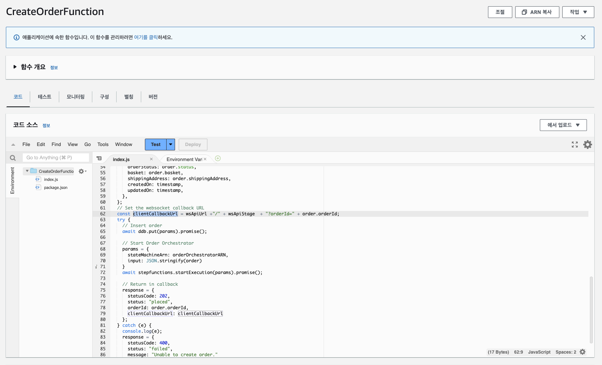
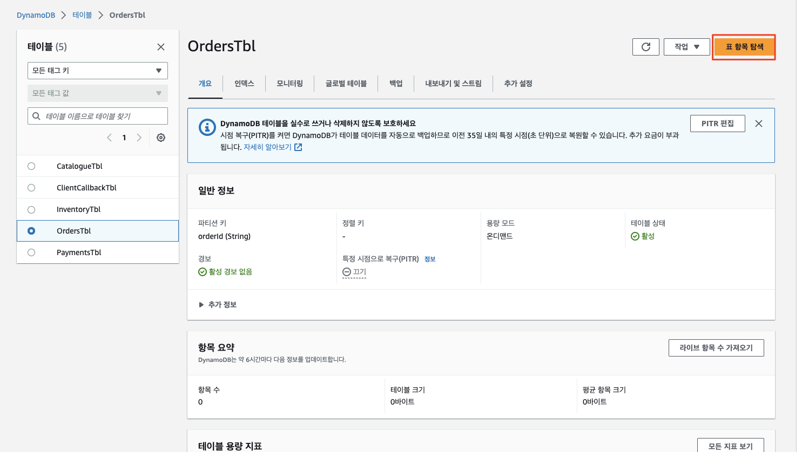
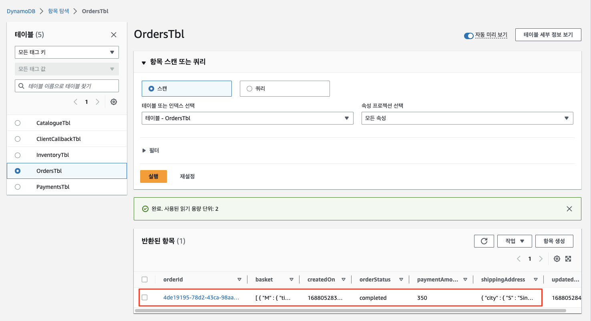

# CreateOrderFunction 람다

## CreateOrderFunction Lambda 함수
1. AWS 콘솔에서 Lambda 서비스로 이동합니다. 그런 다음 ```Lambda > Functions > CreateOrderFunction```에서 CreateOrderFunction Lambda로 이동합니다. 이것은 앞서 살펴본 CreateOrderAPI API Gateway 통합에 의해 호출되는 Lambda 함수입니다.<br>

2. 함수 코드 섹션까지 아래로 스크롤하고 index.js를 클릭하여 소스 코드를 봅니다.<br>


3. CreateOrderFunction Lambda는 주문을 OrdersTbl DynamoDB 테이블에 저장하고 주문 저장에 성공하면 OrderOrchestrator Step Functions 워크플로를 트리거합니다.<br>
```javascript
    // Start Order Orchestrator
    params = {
      stateMachineArn: orderOrchestratorARN,
      input: JSON.stringify(order)
    }
    await stepfunctions.startExecution(params).promise();
```

4. 그러면 CreateOrderFunction Lambda가 API 게이트웨이를 통해 JSON을 웹 프런트엔드로 반환합니다. 반환된 JSON의 예는 아래와 같습니다.<br>
```json
{
    "statusCode": 202,
    "status": "placed",
    "orderId": "9bd8b084-2d20-4ca4-85dc-801f32f59d91",
    "clientCallbackUrl": "wss://vbbkd3me87.execute-api.ap-northeast-2.amazonaws.com/v1?orderId=9bd8b084-2d20-4ca4-85dc-801f32f59d91"
}
```

반환된 JSON은 다음 속성으로 구성됩니다.<br>
* statusCode - HTTP 응답 상태 코드입니다.
* status - 주문 상태('배치됨' 또는 '실패').
* orderId - 시스템에서 생성한 주문의 고유 식별자입니다.
* clientCallbackUrl - 주문 상태에 대한 업데이트를 수신하기 위해 웹 프런트엔드가 열 수 있는 웹 소켓 URL입니다.
                          
## OrdersTbl DynamoDB 테이블

5. AWS 콘솔에서 DynamoDB 서비스로 이동합니다. 그런 다음 ```DynamoDB > Tables > OrdersTbl```로 이동합니다.

6. 가장 최근에 생성된 주문을 보려면 ```표 항목 탐색```을 클릭하십시오.<br>



---

## [[이전]](5.1-create-order-rest-api.md) | [[다음]](6-explore-callback-microservices.md)
