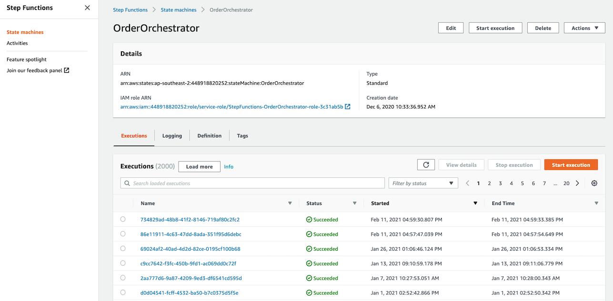
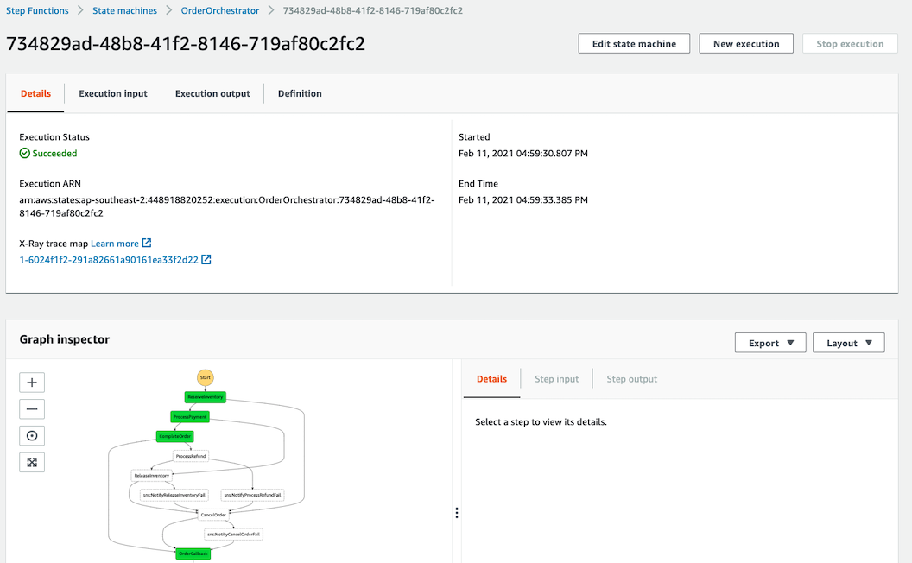
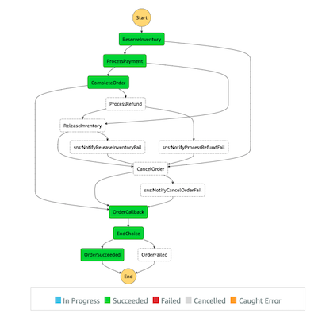
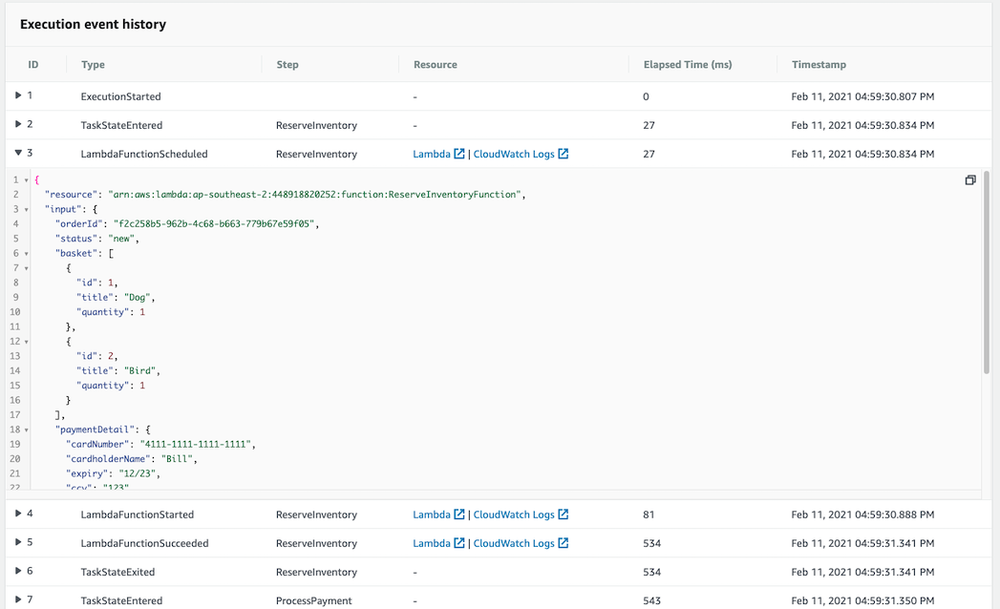

# AWS STEP FUNCTIONS - 성공 트랜잭션 흐름

AWS Step Functions 실행 경로에서 성공 흐름이 어떻게 보이는지 살펴보겠습니다.

1. AWS 콘솔에서 Step Functions 서비스로 이동합니다. 그런 다음 ```Step Functions > State machines > OrderOrchestrator```에서 OrderOrchestrator Step Functions으로 이동합니다.<br>


2. 최근에 성공한 실행을 클릭하여 실행 세부 정보를 살펴봅니다.<br>


3. Graph Inspector까지 아래로 스크롤하여 프로세스 실행 그래프를 봅니다. 확장 아이콘을 사용하여 그래프를 확장할 수 있습니다. 그래프는 주문 트랜잭션 워크플로의 실행 경로와 Lambda 함수를 실행하는 관련 작업을 보여줍니다.<br>


4. 성공 경로 실행 흐름은 다음과 같습니다. ```ReserveInventory > ProcessPayment > CompleteOrder > OrderCallback > EndChoice > OrderSucceeded```. Step Function의 실행된 작업에 대한 세부 정보는 다음과 같습니다.<br>
   * ReserveInventory - ReserveInventoryFunction Lambda를 실행하여 주문한 항목에 대한 재고를 예약합니다.
   * ProcessPayment - ProcessPaymentFunction Lambda를 실행하여 신용 카드 결제를 처리합니다.
   * CompleteOrder - CompleteOrderFunction Lambda를 실행하여 DynamoDB 테이블 및 메시지 JSON에서 주문을 완료된 것으로 표시합니다.
   * OrderCallback - OrderWSCallbackFunction Lambda를 실행하여 주문 상태 완료 시 웹 클라이언트를 업데이트합니다.
   * EndChoice - JSON 메시지의 상태 필드에 따라 프로세스를 성공 또는 실패로 표시하는 선택 작업입니다.
   * OrderSuccess - 프로세스를 '성공'으로 표시하는 작업입니다.

5. ```상태 시스템 (State Machine)```의 워크플로 정의를 보려면 위로 스크롤하고 정의 탭을 클릭합니다. ```Amazon 상태 언어 (Amazon States Language)```를 사용하여 워크플로를 정의합니다.<br>


6. 실행 이벤트 히스토리 섹션까지 아래로 스크롤하고 임의의 이벤트를 펼치면 JSON 메시지 플로우를 볼 수 있습니다. 이벤트 실행 흐름을 따라 다른 상태를 통과할 때 JSON 메시지를 볼 수 있습니다.<br>


---

## [[이전]](7-explore-step-functions.md) | [[다음]](7.2-aws-step-functions-compensating-transaction-flow.md)
